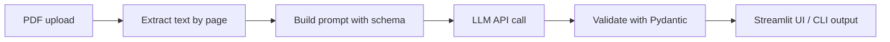

# Finance Doc Summarizer

**Upload a PDF. Get a structured, page-referenced summary in under a minute.**

> 🚧 Status: in development. Sections marked `TODO` get filled in as the build progresses.

<!-- TODO: add demo GIF (10 to 15 seconds: upload, wait, result) -->


**Live demo:** TODO (Hugging Face Spaces link)

---

## Problem

Analysts spend hours reading long policies, reports and contracts to find what matters. This tool pulls out the key points, figures, risks and action items, and tells you which page each came from, so you can verify fast.

## What it does

- Reads a text-based PDF (up to ~50 pages)
- Returns a **structured summary** as JSON and Markdown
- Gives a **page reference** for every key point, figure and risk
- Returns nothing for a field when the document doesn't say it (no guessing)

## Output fields

| Field | Description |
|-------|-------------|
| `title`, `doc_type` | What the document is |
| `one_line_summary` | The document in 25 words or fewer |
| `executive_summary` | 3 to 5 sentences |
| `key_points` | Main takeaways, with page numbers |
| `key_figures` | Numbers, dates, amounts, with page numbers |
| `risks_or_obligations` | What the reader must watch or do |
| `action_items` | Who, what, deadline if stated |
| `open_questions` | What the document leaves unclear |

## How it works



1. Text is extracted page by page so page numbers survive.
2. A fixed prompt tells the model to answer only from the document and return JSON.
3. The response is validated against a schema. Invalid output triggers one retry.

## Tech stack

- **Python 3.11+**
- **pdfplumber**: PDF text extraction
- **Anthropic API** (`anthropic` SDK): summarization. Model is set in `.env`.
- **Pydantic**: output validation
- **Streamlit**: web UI
- **pytest**: tests

## Quick start

> TODO: test every command below in a fresh GitHub Codespace before publishing.

```bash
# 1. Clone
git clone https://github.com/<your-username>/finance-doc-summarizer.git
cd finance-doc-summarizer

# 2. Create a virtual environment
python -m venv .venv
source .venv/bin/activate        # Windows: .venv\Scripts\activate

# 3. Install dependencies
pip install -r requirements.txt

# 4. Add your API key
cp .env.example .env
# Open .env and paste your key

# 5a. Run the web app
streamlit run app.py

# 5b. Or use the command line
python summarize.py data/samples/example.pdf
```

## Example

**Input:** `data/samples/<sample-document>.pdf`

**Output (shape only; real output added after testing):**

```json
{
  "title": "...",
  "doc_type": "policy",
  "one_line_summary": "...",
  "executive_summary": "...",
  "key_points": [
    { "text": "...", "page": 3 }
  ],
  "key_figures": [
    { "label": "...", "value": "...", "page": 7 }
  ],
  "risks_or_obligations": [
    { "text": "...", "page": 12 }
  ],
  "action_items": [
    { "who": "...", "what": "...", "deadline": "..." }
  ],
  "open_questions": ["..."]
}
```

<!-- TODO: replace with a real output from a public document -->

## Evaluation

TODO. Plan: test on 5 public PDFs. Score each by hand for correctness, page-reference accuracy, invented claims and missed items. Full results in [`eval/results.md`](eval/results.md).

| Metric | Result |
|--------|--------|
| Documents tested | TODO |
| Key points judged correct | TODO |
| Page references correct | TODO |
| Invented claims found | TODO |

## Limitations

- **No scanned PDFs.** There is no OCR yet. Image-only PDFs return nothing.
- **Tables can scramble.** Text extraction doesn't preserve table layout well.
- **Length cap.** Documents over ~50 pages are rejected or truncated.
- **The model can be wrong.** Always check page references before relying on a point.
- **Not financial or legal advice.** This is a reading aid.
- TODO: add failures found during evaluation.

## Roadmap

- [ ] Chunked summarization for long documents
- [ ] Compare two versions of a document
- [ ] OCR for scanned PDFs
- [ ] Model comparison scorecard

## Project docs

- [`SCOPE.md`](SCOPE.md): goals, scope, milestones

## License

MIT. See [`LICENSE`](LICENSE).

## Author

**Preetham Raj Mahadeva** · Guelph, Ontario
[LinkedIn](TODO) · [GitHub](TODO)
